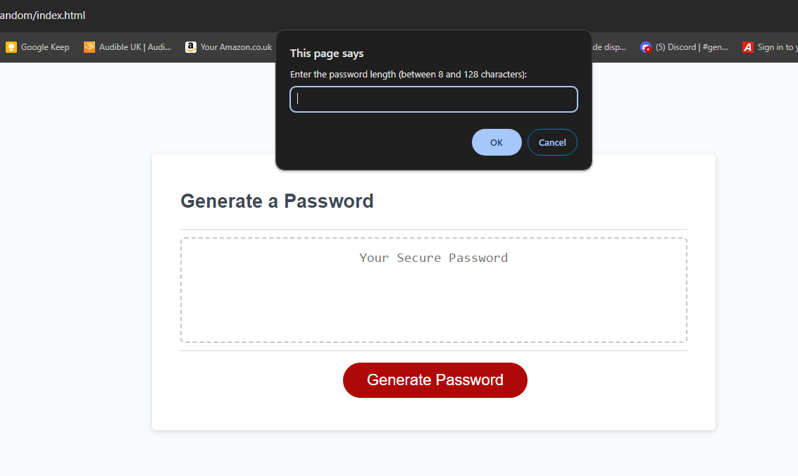

# Password_Generator_Random 

# Task: To create an application that an employee can use to generate a random password based on criteria they’ve selected by modifying starter code. This app will run in the browser, and will feature dynamically updated HTML and CSS powered by JavaScript code that you write. It will have a clean and polished user interface that is responsive, ensuring that it adapts to multiple screen sizes.

* Generate a password when the button is clicked
  * Present a series of prompts for password criteria
    * Length of password
      * At least 8 characters but no more than 128.
    * Character types
      * Lowercase
      * Uppercase
      * Numeric
      * Special characters ($@%&*, etc)
  * Code should validate for each input and at least one character type should be selected
  * Once prompts are answered then the password should be generated and displayed in an alert or written to the page

  # Steps:
  * added prompt for the user request password options and return an array of selected characters and a check to see if task completed
  * Added code for the check of the length of the password and if it is too short or too long then the user is prompted to enter a new length and return an array of selected characters and a check to see if task completed.
  * Add the options and the prompts for the user to select the character types and return an array of selected characters and a check to see if task completed.
  *added check for characters used and if not selected then the user is prompted to select at least one character type and return an array of selected characters and a check to see if task completed
  * Added function to randomise the output of the password and return the password and a check to see if task completed 
  * Added code for the chack of character types and possible characters based on user input.

  First prompt  

  

  Second prompt  
  

  Third prompt   

  

    Fourth prompt   

    

    Fifth prompt    

    

    Sixth prompt      

    

    Still a lot to learn and understand about Java script and how to use it to create a password generator, but I hope I managed to get something working.

    Have a great day, thanks for reading :)